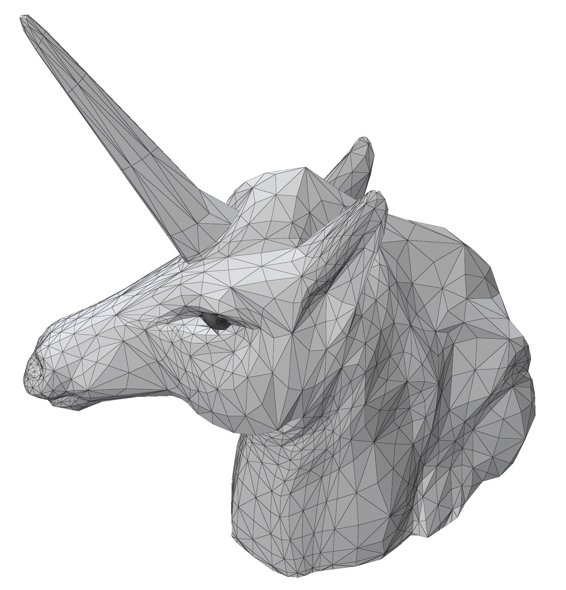
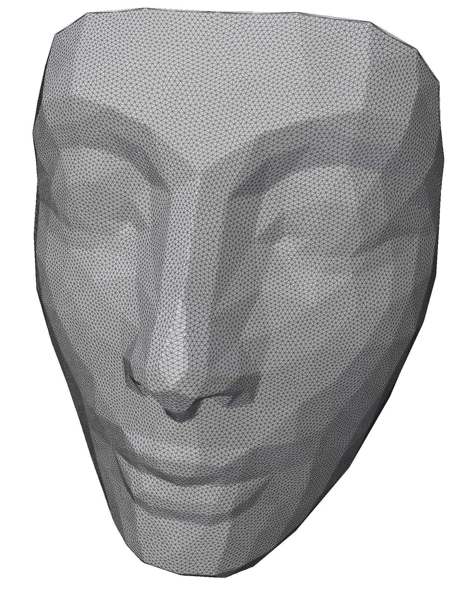

# Surface Remesher

Surface Remesher remeshes a surface mesh using the centroidal Voronoi tessellation. The input is a triangulated surface mesh. We first cut the surface into a topological disk, then parameterize it in a planar space. We compute the centroidal Voronoi tessellation (CVT) in the parameter space with respect to a density distribution, and construct the constrained Delaunay triangulation (CDT) from the resulted CVT. The final optimized surface mesh is then obtained from the CDT.

For the following images demonstrate the input image and the corresponding result of Sufrace Remesher:







## Building

Build `surfremesh` executable in a Docker container:

```
docker build -t surfremesh .
```


## Usage

Execute `surfremesh` in a Docker container with GPU enabled:

```
docker run --gpus=all --rm -it -v (pwd):(pwd) surfremesh /app/build/surfremesh (pwd)/examples/pig.off
```


## References

1. [Jiaqi Zheng and Tiow-Seng Tan. 2020. Computing Centroidal Voronoi Tessellation Using the GPU. In Symposium on Interactive 3D Graphics and Games (I3D ’20), May 5–7, 2020, San Francisco, CA, USA.](https://doi.org/10.1145/3384382.3384520)
2. [Pierre Alliez, Éric Colin de Verdière, Olivier Devillers, and Martin Isenburg. 2005. Centroidal Voronoi Diagrams for Isotropic Surface Remeshing. Graphical Models, Elsevier, 2005, 67 (3), pp.204-231.](https://hal.inria.fr/hal-00787166)
3. [Meng Qi, Thanh-Tung Cao, and Tiow-Seng Tan. 2012. Computing 2D Constrained Delaunay Triangulation Using the GPU. In Proceedings of the ACM SIGGRAPH Symposium on Interactive 3D Graphics and Games (I3D ’12).](https://doi.org/10.1145/2159616.2159623)
4. [Qingnan Zhou and Alec Jacobson. 2016. Thingi10K: A Dataset of 10,000 3D-Printing Models. arXiv:1605.04797.](https://ten-thousand-models.appspot.com/)

